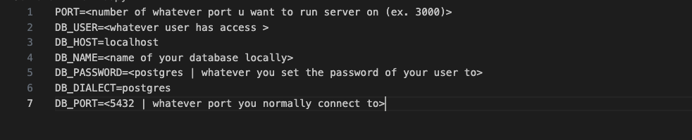

# Restaurant

## Prerequisites
Please make sure you have:
- Node (latest version)

## Set Up 
First clone the repository
Go into the Server Folder
    Run "npm install"
    Create a file named ".env" in this directory
    Structure .env file as picture below with your database specific details
    Notes:
        Do not change Host and Dialect 
        Password is postgres unless you specified otherwise sometime during setup
        PORT is the port you want the server to run on
        DB_PORT is the port you connect to the database on (usually tells you when you start the server locally)
    
    Once your env file is set up, start your db server locally 
    Start server by running "node server.js" and you can navigate to the page by following the link that has been printed to the console/logged
    To check the database and if it returns well - check if any error logs appear in the console and add "/testNow" to the link in your browser to see the query rows outputted
Go into Client Folder
    Run "npm install"
    Run "npm run dev" and go the link specified in the console
    For this folder, it is the UI, so each page will be its own component - look into how to make components/modularized pages in react and then we can tie it all together later 